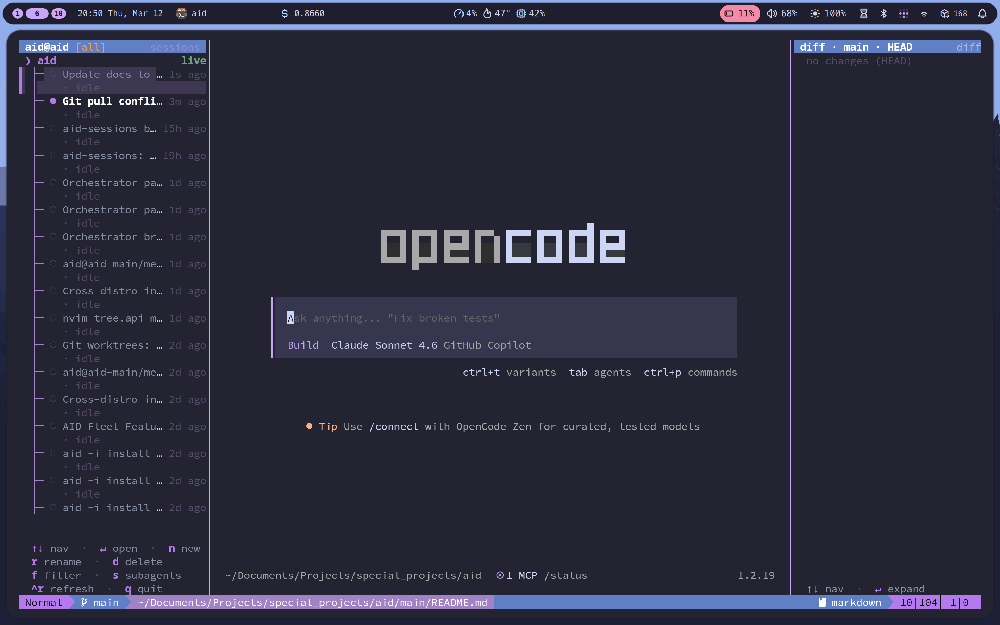

# AID

> **Early beta.** Works well day-to-day, but rough edges exist. Arch only for now. Feedback welcome.

Terminal IDE built on tmux + Neovim + [Opencode](https://opencode.ai). Persistent panes — file browser, editor, AI assistant, session navigator, live diff — that survive reboots, SSH drops, and branch switches.




## Install

```bash
curl -fsSL https://raw.githubusercontent.com/bk-bf/aid/main/boot.sh | bash
```

Installs to `~/.local/share/aid`. Override: `AID_DIR=~/aid curl ...`

Re-running is safe — idempotent.

## Usage

```bash
aid              # new session in current directory
aid -a           # attach to a running session (interactive list)
aid -a aid@myproject # attach directly by name
aid --no-ai      # session without opencode (editor + sidebar only)
```

Sessions are named `aid@<dirname>` automatically.

## Layout

Every `aid` session has **two windows**. Switch between them with `prefix+1` / `prefix+2`.

**Window 1 — IDE** (`prefix+1`): file tree sidebar + nvim editor + opencode.

**Window 2 — Orchestrator** (`prefix+2`): session navigator + opencode (HTTP API) + live diff. Always present — even in a normal `aid` session. Birds-eye view of all running sessions and the current diff without leaving your editor.

---

## Orchestrator window — parallel AI workflow

Every `aid` session ships with an orchestrator window (`prefix+2`): a [Codex](https://openai.com/index/openai-codex/)-style parallel workflow built in. Multiple opencode conversations run concurrently, each isolated in its own `aid@<project>` tmux session, navigable from a persistent sidebar. Switch to it at any time with `prefix+2`; return to your editor with `prefix+1`.

This is how it works:

1. **Each task gets its own session.** Press `n` in the session navigator to spin up a new `aid@<project>` session — a fresh opencode instance in its own tmux session, attached to a repo of your choice.
2. **Switch conversations without leaving the navigator.** The left pane lists every session and every conversation inside it. Press `Enter` to load a conversation — opencode in the center pane switches to it instantly. If the conversation belongs to a different session, aid focuses that terminal window (via Hyprland `focuswindow`, or spawns a new kitty if none is open).
3. **The editor is always one keypress away.** `prefix+1` takes you back to nvim + opencode side by side, ready to edit whatever the AI has touched.
4. **Live diff in the right pane.** `aid-diff` watches the repo with `inotifywait` and re-renders `git diff HEAD` (or staged / unstaged — cycle with `t`) on every change. See exactly what the agent wrote before you switch back to the editor.
5. **Sessions persist across restarts.** Metadata (repo path, branch, last active) is stored in `~/.local/share/aid/sessions.json`. Dead sessions are shown in the navigator and can be resurrected.

### Navigator keys

| Key | Action |
|-----|--------|
| `↑`/`k`, `↓`/`j` | Move cursor |
| `PgUp`/`PgDn` | Jump ±10 rows |
| `Enter` | Load conversation / focus session / resurrect dead session |
| `n` | New session |
| `r` | Rename session |
| `d` | Delete session (`y`/`n` confirm) |
| `Ctrl-R` | Force full refresh |
| `q` / `Esc` | Quit navigator |

### Diff pane keys

| Key | Action |
|-----|--------|
| `↑`/`k`, `↓`/`j` | Scroll |
| `Enter`/`Space` | Expand/collapse file diff |
| `t` | Cycle diff mode (HEAD → staged → unstaged) |
| `r`/`Ctrl-R` | Refresh |
| `q` / `Esc` | Quit |

### Window navigation

| Shortcut | Destination |
|----------|-------------|
| `prefix+1` | IDE window — editor + AI + sidebar |
| `prefix+2` | Orchestrator window — navigator + opencode + diff |

---

## What makes it different

Most Neovim setups configure the editor. aid orchestrates a full workspace.

**Persistent sidebar.** The file browser is a separate, isolated `nvim` instance (`NVIM_APPNAME=treemux`). It never closes, survives editor restarts, and communicates with the main editor over a Unix socket.

**AI as a first-class pane.** Opencode lives in a tmux pane, not a plugin. It persists context across file switches and can read your terminal output directly.

**Orchestrator window always present.** Every session ships with the session navigator + opencode (HTTP API) + live diff as Window 2 (`prefix+2`). Parallel AI workflow is one keypress away from any project.

**Git-sync coordinator.** A central `sync.lua` module refreshes gitsigns, nvim-tree, and the sidebar after every branch switch — no stale state after lazygit.

**Cross-project bookmarks.** A global plain-text file (`~/.local/share/nvim/global_bookmarks`) that works across unrelated directories, unlike project-scoped tools.

**SSH-native.** Everything runs in tmux — detach, reattach, or connect from another machine without losing state.

## Requirements

- tmux ≥ 3.2
- nvim ≥ 0.9
- bun (`sudo pacman -S bun` on Arch/CachyOS — required by the session navigator)
- python-pynvim (`sudo pacman -S python-pynvim`)
- opencode (`npm i -g opencode` or see [opencode.ai](https://opencode.ai))
- A Nerd Font

## Updating

```bash
aid -i
```

Safe to re-run after `tpm update` — restores the custom `watch_and_update.sh` symlink.

## Acknowledgements

aid is an orchestration layer — the real work is done by these projects:

**Core**
- [tmux](https://github.com/tmux/tmux) — terminal multiplexer that holds the whole workspace together
- [Neovim](https://github.com/neovim/neovim) — editor and RPC host
- [opencode](https://github.com/opencode-ai/opencode) — AI assistant pane
- [lazygit](https://github.com/jesseduffield/lazygit) — terminal Git UI

**tmux plugins**
- [tpm](https://github.com/tmux-plugins/tpm) — tmux plugin manager
- [treemux](https://github.com/kiyoon/treemux) — persistent sidebar pane manager

**Neovim plugin manager**
- [lazy.nvim](https://github.com/folke/lazy.nvim) — plugin manager

**Neovim plugins**
- [nvim-tree](https://github.com/nvim-tree/nvim-tree.lua) — file explorer
- [nvim-web-devicons](https://github.com/nvim-tree/nvim-web-devicons) — filetype icons
- [telescope.nvim](https://github.com/nvim-telescope/telescope.nvim) — fuzzy finder
- [plenary.nvim](https://github.com/nvim-lua/plenary.nvim) — Lua utility library
- [gitsigns.nvim](https://github.com/lewis6991/gitsigns.nvim) — git hunk signs and navigation
- [lazygit.nvim](https://github.com/kdheepak/lazygit.nvim) — lazygit inside Neovim
- [bufferline.nvim](https://github.com/akinsho/bufferline.nvim) — tab bar
- [nvim-treesitter](https://github.com/nvim-treesitter/nvim-treesitter) — syntax highlighting
- [nvim-lspconfig](https://github.com/neovim/nvim-lspconfig) — LSP client configuration
- [nvim-cmp](https://github.com/hrsh7th/nvim-cmp) + [cmp-nvim-lsp](https://github.com/hrsh7th/cmp-nvim-lsp) + [cmp-buffer](https://github.com/hrsh7th/cmp-buffer) + [cmp-path](https://github.com/hrsh7th/cmp-path) — autocompletion
- [mini.nvim](https://github.com/echasnovski/mini.nvim) (pairs, cursorword, statusline) — editing utilities and statusline
- [vim-tpipeline](https://github.com/vimpostor/vim-tpipeline) — pipes Neovim statusline into tmux status bar
- [persistence.nvim](https://github.com/folke/persistence.nvim) — session save/restore
- [undotree](https://github.com/mbbill/undotree) — visual undo history
- [which-key.nvim](https://github.com/folke/which-key.nvim) — keymap popup
- [markdown-preview.nvim](https://github.com/iamcco/markdown-preview.nvim) — browser Markdown preview
- [tokyonight.nvim](https://github.com/folke/tokyonight.nvim) — colorscheme
- [oil.nvim](https://github.com/stevearc/oil.nvim) — directory editing
- [neo-tree.nvim](https://github.com/nvim-neo-tree/neo-tree.nvim) — alternative file explorer
- [nui.nvim](https://github.com/MunifTanjim/nui.nvim) — UI components
- [nvim-notify](https://github.com/rcarriga/nvim-notify) — notification popups
- [tmux.nvim](https://github.com/aserowy/tmux.nvim) — tmux/nvim clipboard and navigation sync
- [nvim-tree-remote.nvim](https://github.com/kiyoon/nvim-tree-remote.nvim) — sidebar→editor file open over Unix socket
- [tmux-send.nvim](https://github.com/kiyoon/tmux-send.nvim) — send lines from sidebar to tmux pane
- [nvim-dap](https://github.com/mfussenegger/nvim-dap) + [nvim-dap-ui](https://github.com/rcarriga/nvim-dap-ui) + [mason-nvim-dap](https://github.com/jay-babu/mason-nvim-dap.nvim) — debug adapter protocol
- [lspkind.nvim](https://github.com/onsails/lspkind.nvim) — completion menu icons

## License

MIT
